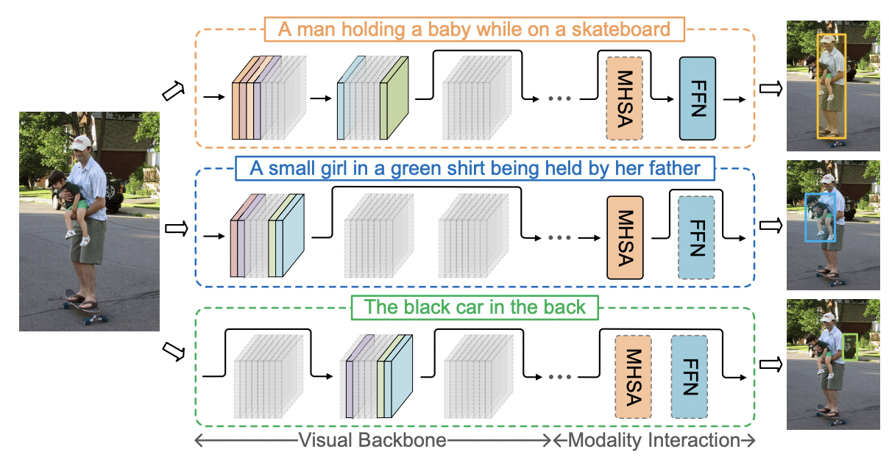

# Referring Expression Comprehension Using Language Adaptive Inference

## Introduction



<center>Figure 1: The schematic of the proposed framework</center>

Different from universal object detection, referring expression comprehension (REC) aims to locate specific objects
referred to by natural language expressions. The expression
provides high-level concepts of relevant visual and contextual patterns, which vary significantly with different expressions and account for only a few of those encoded in the
REC model. This leads us to a question: do we really need
the entire network with a fixed structure for various referring
expressions? Ideally, given an expression, only expression relevant components of the REC model are required. These
components should be small in number as each expression
only contains very few visual and contextual clues. This paper explores the adaptation between expressions and REC
models for dynamic inference. Concretely, we propose a neat
yet efficient framework named Language Adaptive Dynamic
Subnets (LADS), which can extract language-adaptive subnets from the REC model conditioned on the referring expressions. By using the compact subnet, the inference can be
more economical and efficient. Extensive experiments on RefCOCO, RefCOCO+, RefCOCOg, and Referit show that the
proposed method achieves faster inference speed and higher
accuracy against state-of-the-art approaches.


<center>Figure 2: The overall architecture of our proposed LADS framework</center>

As Fig.2 says, Our proposed LADS framework contains a REC supernet and a Gating Network. The Gating Network is the core module of the LADS framework, which takes linguistic features as input and extracts compact expression-adaptive subnets from the REC supernet by generating binary gates for the layers and filters.

## Experiment setting

In this paper, two types of experiments are carried out, the first type of experiment is to train the proposed LADS directly on a specific dataset; The second type of experiment is to train the proposed LADS on large scale REC dataset and then fine-tune it on a specific dataset. The visual and textual backbones of both experiments were initialized with pre-trained weights, and the rest were initialized with Xavier.

## Environment

1. Install mindspore2.0.0-alpha

[Official tutorials](https://gitee.com/mindspore/docs/blob/r2.0.0-alpha/install/mindspore_gpu_install_pip.md)

2. Install mindformers0.2.0

[Official tutorials](httpsgitee.com/mindspore/mindformers/tree/r0.2/)

3. Install other packages

```sh
pip install -r requirements.txt
```

## Preparation of datasets and pre-training files

### Datasets

Refcoco, refcoco+ and refcocog are based on COCO2014, so you need to download [coco2014](https://cocodataset.org/). Referit is based on saiaprtc12.

Place the dataset according to the following structure:
```
$DATA_PATH
|---images
|   |---mscoco
|       |---train2014
|           |---***.jpg
|   |---saiaprtc12
|       |---***.jpg
```

Change the dataset_root in src/path_info to $DATASET_PATH and the image_root_referit to $DATASET_PATH/images/saiaprtc12.

Download the dataset config file.

## Code usage

### Train

```sh
sh scripts/train_{dataset_name}.sh
# sh scripts/train_refcoco.sh

sh scripts/finetune_{dataset_name}.sh

sh文件中选项解释：
--batch_size       "batch size of single GPU"
--batch_sum        "batch size of all GPUs"
--trainable_layers "trainable layers of resnet"
--norm_layer       "type of normalization layer in resnet"
--max_epochs       "max training epoch"
--drop_epochs      "epochs in which the learning rate drops"
--warmup_steps     "steps of warming up"
--eval_step        "the frequency of validation during training"
--dataset_type     "the dataset used to train"
--splitBy          "splitBy"
--translate        "whether to translate during data augmentation"
--multi_scale      "whether to use multi-scale image during resize"
--arch_loss_coef   "coefficient of arch_loss"
--lr_base          "base learning rate"
--lr_visual        "learning rate of visual backbone"
--lr_lang          "learning rate of language backbone"
--comments         "comments"
```

### Eval

```sh
sh scripts/eval_{dataset_name}.sh

```

## Reference

[1] Su, W., Miao, P., Dou, H., Fu, Y., & Li, X. (2023). Referring Expression Comprehension Using Language Adaptive Inference. Proceedings of the AAAI Conference on Artificial Intelligence, 37(2), 2357-2365.

## Acknowledgement

LADS referred or used following tools:
* Mindspore
* MindFormers
* pillow
* numpy
* collections
* cybertron
* scipy
* datetime
* rich
* tqdm
* collections
* pprint
* yaml
* shutil