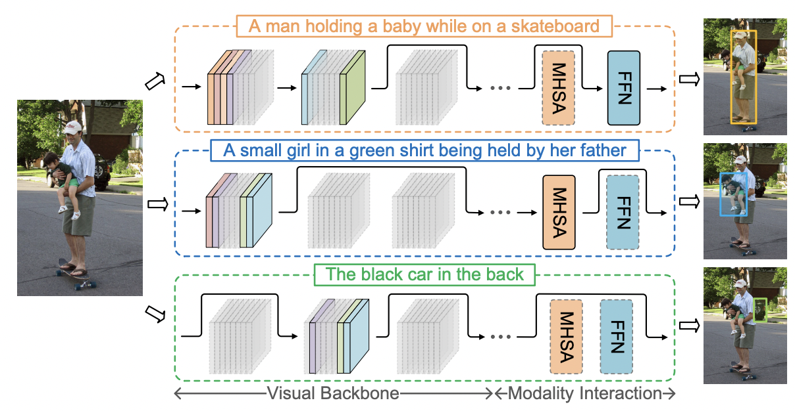
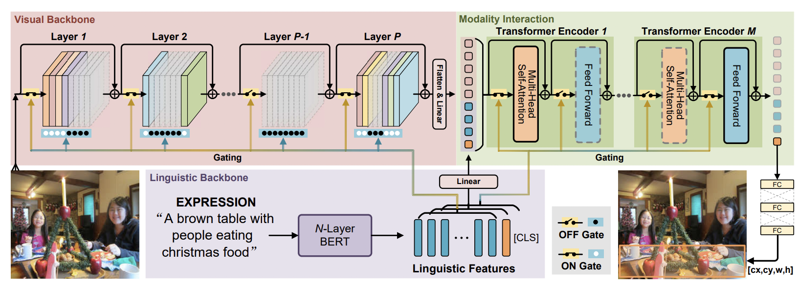

[ENGLISH](README.md)|简体中文

# Referring Expression Comprehension Using Language Adaptive Inference

## 简介



<center>Figure 1: The schematic of the proposed framework</center>

与普遍的对象检测不同，指代表达理解（REC）旨在定位自然语言表达所指的特定对象。该表达式提供了相关视觉和上下文模式的高级概念，这些模式随着不同的表达式而显著变化，并且只占REC模型中编码的少数。这就引出了一个问题：我们真的需要一个固定结构的整个网络来表达各种指称吗？理想情况下，给定一个表达式，只需要REC模型中与表达式相关的组件。这些组件的数量应该很小，因为每个表达式只包含很少的视觉和上下文线索。本文探讨了表达式和REC模型之间的动态推理适应性。具体地说，我们提出了一个简洁高效的框架，称为语言自适应动态子网（LADS），它可以从REC模型中提取出基于引用条件的语言自适应子网。通过使用紧凑子网，推理可以更加经济高效。在RefCOCO、RefCOCO+、RefCOCOg和Referit上的大量实验表明，与最先进的方法相比，所提出的方法实现了更快的推理速度和更高的精度。



<center>Figure 2: The overall architecture of our proposed LADS framework</center>

如图二所示，LADS网络由一个REC supernet和门控网络组成。在推理时，门控网络首先根据文本骨干提取到的文本特征生成视觉骨干和模态交互部分的开关，通过开关机制提取出了表达式自适应的子网络。

## 实验设置

文中进行了两类实验，第一类实验为将所提出的LADS直接在特定的数据集上进行训练；第二类实验为将所提出的LADS先在大规模REC数据集上训练，再在特定的数据集上微调。两类实验的视觉和文本backbone均采用预训练权重进行初始化，其余部分采用Xavier初始化。

## 可用的模型和数据集

|数据集|文件名|描述|Model URL|
|-----|-----|---|-----|
|

## 环境配置

1. 安装mindpore2.0.0-alpha

   具体步骤参照[官方安装教程](https://gitee.com/mindspore/docs/blob/r2.0.0-alpha/install/mindspore_gpu_install_pip.md)

2. 安装mindformers0.2.0
   具体步骤参照[官方教程](https://gitee.com/mindspore/mindformers/tree/r0.2/)

3. 安装其他包
   ```sh
   pip install -r requirements.txt
   ```

## 数据集和预训练文件的准备

### 数据集

refcoco、refcoco+、refcocog均是基于coco2014数据集的，因此需要先下载[coco2014数据集](https://cocodataset.org/)。
referit数据集是基于saiaprtc12数据集的。

将数据集按照以下结构放置：
```
$DATA_PATH
|---images
|   |---mscoco
|       |---train2014
|           |---***.jpg
|   |---saiaprtc12
|       |---***.jpg
```
并将src/path_info内的dataset_root改为$DATASET_PATH，image_root_referit改为$DATASET_PATH/images/saiaprtc12。

下载数据集配置文件


## 代码使用

### 训练

```sh
sh scripts/train_{dataset_name}.sh
# sh scripts/train_refcoco.sh

sh scripts/finetune_{dataset_name}.sh

sh文件中选项解释：
--batch_size       单卡批次大小
--batch_sum        多卡总批次大小=单卡批次大小*卡数*梯度累计数
--trainable_layers resnet可训练层数
--norm_layer       resnet中norm layer类型
--max_epochs       总训练epoch数
--drop_epochs      学习率下降的epoch
--warmup_steps     warm up的步数
--eval_step        训练过程中的验证频次
--dataset_type     训练的数据集类型，如refcoco
--splitBy          与数据集相对应
--translate        数据增强中是否translate
--multi_scale      数据增强中的随机resize参数
--arch_loss_coef   arch_loss的系数
--lr_base          基础学习率
--lr_visual        视觉backbone的学习率
--lr_lang          语言模型的学习率
--comments         对本次训练内容的标记
```

### 验证

```sh
sh scripts/eval_{dataset_name}.sh

```


## 引用

[1] Su, W., Miao, P., Dou, H., Fu, Y., & Li, X. (2023). Referring Expression Comprehension Using Language Adaptive Inference. Proceedings of the AAAI Conference on Artificial Intelligence, 37(2), 2357-2365.

## 致谢

LADS的mindspore实现使用了以下工具：
* Mindspore
* MindFormers
* pillow
* numpy
* collections
* cybertron
* scipy
* datetime
* rich
* tqdm
* collections
* pprint
* yaml
* shutil