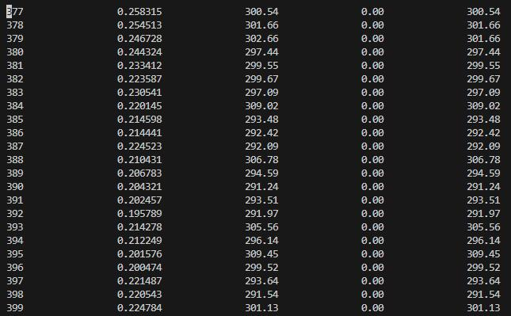
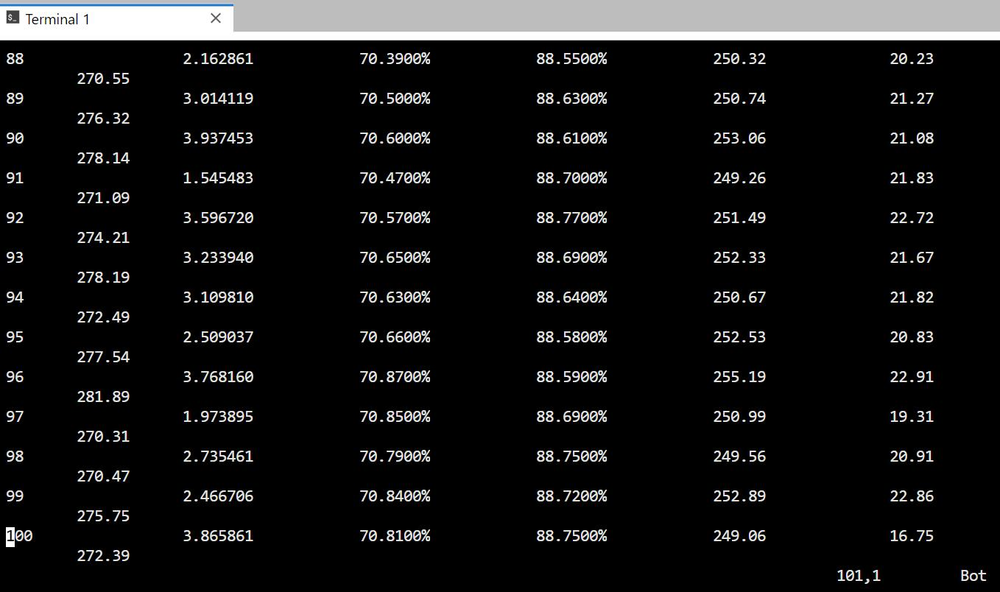

# Mindspore Implementation of the paper [Learning the Relation between Similarity Loss and Clustering Loss in Self-Supervised Learning](https://arxiv.org/pdf/2301.03041.pdf)
This is a MIM version for the work. For more details, please refer to the paper.

Our code is based on [mindcv](https://github.com/mindspore-lab/mindcv). Installation and preparation follow that repo. 

## Pretrain
`python pretrain.py -c LRSL_b_16_224_pretrain_ascend.yaml` 

## Finetune
`python finetune.py -c LRSL_b_16_224_finetune_ascend.yaml` 

## Loss log for pretrain

## Accuracy for tiny-imagenet

