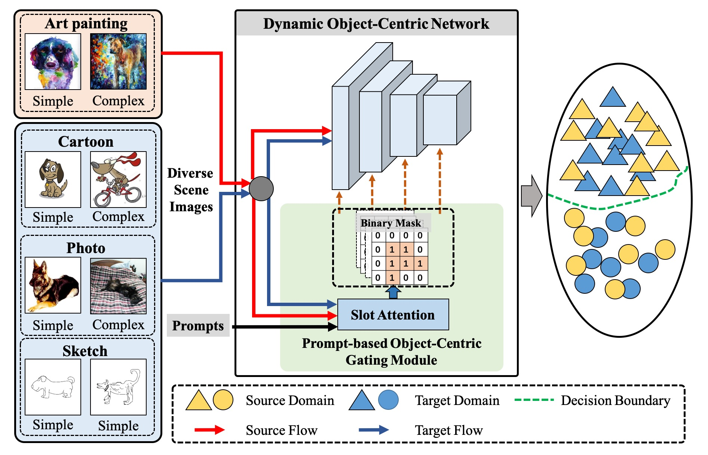
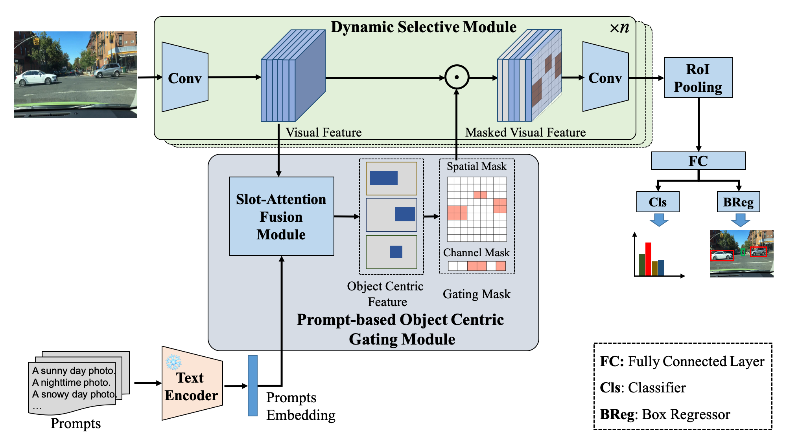

# Prompt-Driven Dynamic Object-Centric Learning for Single Domain Generalization
This repo is the MindSpore implementation of Prompt-Driven Dynamic Object-Centric Learning for Single Domain Generalization (CVPR 2024).

> **Abstract:** *Single-domain generalization aims to learn a model from single source domain data to achieve generalized performance on other unseen target domains. Existing works primarily focus on improving the generalization ability of static networks. However, static networks are unable to dynamically adapt to the diverse variations in different image scenes, leading to limited generalization capability. Different scenes exhibit varying levels of complexity, and the complexity of images further varies significantly in cross-domain scenarios. In this paper, we propose a dynamic object-centric perception network based on prompt learning, aiming to adapt to the variations in image complexity. Specifically, we propose an object-centric gating module based on prompt learning to focus attention on the object-centric features guided by the various scene prompts. Then, with the object-centric gating masks, the dynamic selective module dynamically selects highly correlated feature regions in both spatial and channel dimensions enabling the model to adaptively perceive object-centric relevant features, thereby enhancing the generalization capability. Extensive experiments were conducted on single-domain generalization tasks in image classification and object detection. The experimental results demonstrate that our approach outperforms state-of-the-art methods, which validates the effectiveness and generally of our proposed method.*

## 1. Illustration of dynamic object-centric learning via prompts for single domain generalization. 

<p align="center">
    
</p>

Object-centric features capture the essential information related to individual objects.
Incorporating the given scene prompts to dynamically optimize the extraction of object-centric features is beneficial for improving the generalization performance of models.

## 2. Method

<p align="center">
    
</p>

The proposed prompt-based dynamic object-centric learning framework. It mainly includes a prompt-based object-centric gating module and a dynamic selective module. First, the Slot Attention multimodal fusion module extracts object-centric features and leverages the various scene prompts to guide the object-centric gating mask learning for the input from different scenes. Next, the gating mask is used to dynamically select the relevant object-centric features to improve the
generalization ability.

## 3. Usage
### 3.1 Prepare data
#### Image Classificaton : PACS (Art paintings, Cartoons, Photos, and Sketches)
#### Object Detection: Diverse-Weather Dataset(Daytime-Sunny, Night-Sunny, Dusk-Rainy, Night-Rainy, and Daytime-Foggy)


### 3.2 Dependencies

	Python: 3.8.10
	MindSpore: 2.1.1
	Pillow: 9.5.0
	NumPy: 1.22.4
	PIL: 7.2.0

### 3.3 Train and Test

- Test on target domain (PACS)

```
CUDA_VISIBLE_DEVICES=0  python main.py -d 'dataset' -dset imagenet -a resdg18 --checkpoint model_ckpt \
     --pretrained ./model_ckpt/mindspore_PACS_art_painting_model_best.ckpt --source 'art_painting' --single --evaluate
CUDA_VISIBLE_DEVICES=0  python main.py -d 'dataset' -dset imagenet -a resdg18 --checkpoint model_ckpt \
     --pretrained ./model_ckpt/mindspore_PACS_cartoon_model_best.ckpt --source 'cartoon' --single --evaluate
CUDA_VISIBLE_DEVICES=0  python main.py -d 'dataset' -dset imagenet -a resdg18 --checkpoint model_ckpt \
     --pretrained ./model_ckpt/mindspore_PACS_photo_model_best.ckpt --source 'photo' --single --evaluate
CUDA_VISIBLE_DEVICES=0  python main.py -d 'dataset' -dset imagenet -a resdg18 --checkpoint model_ckpt \
     --pretrained ./model_ckpt/mindspore_PACS_sketch_model_best.ckpt --source 'sketch' --single --evaluate
```
