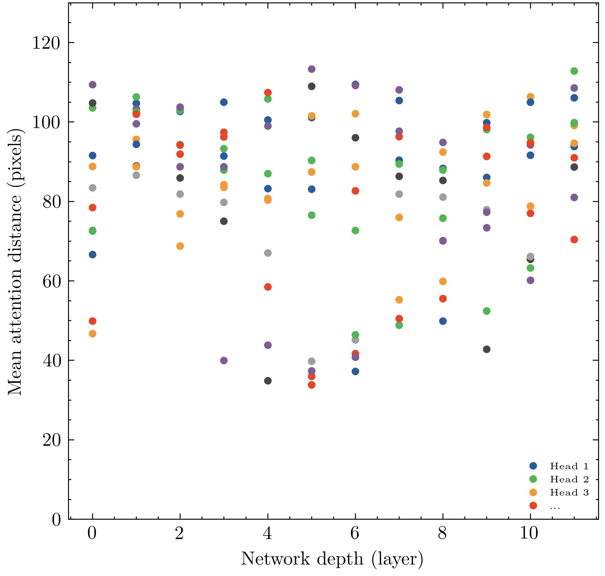
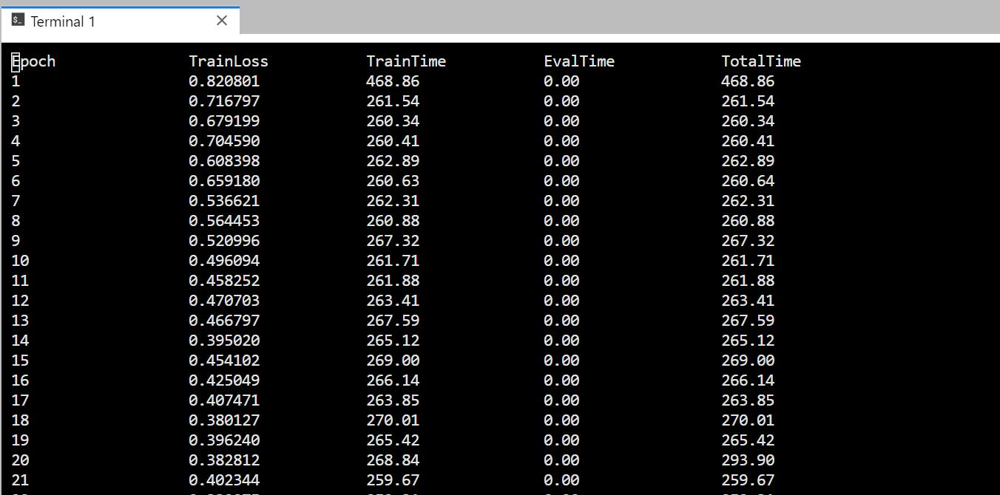
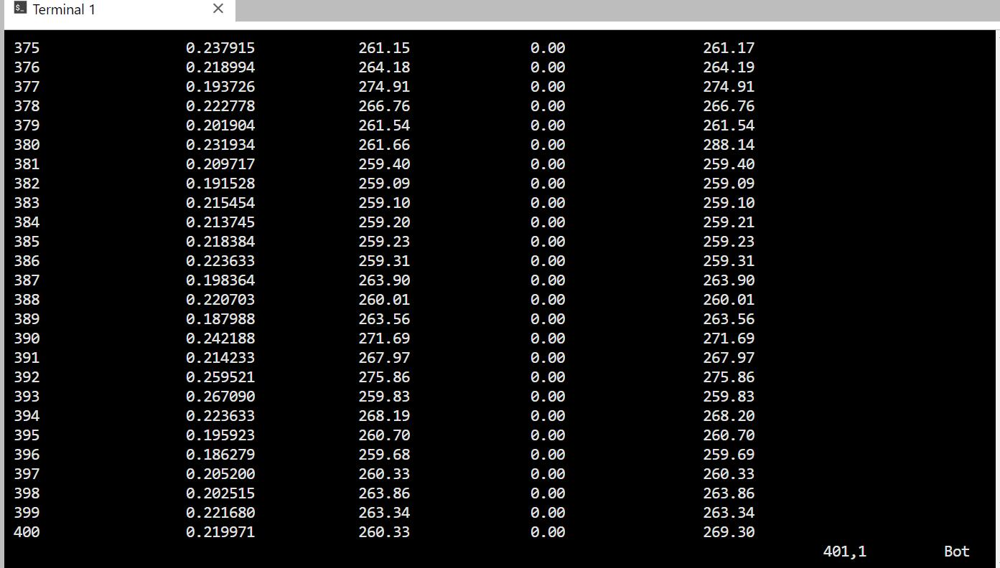

# Mindspore Implementation of the paper [TOWARDS UNDERSTANDING MASKED DISTILLATION](https://openreview.net/pdf/c668d7bd47dcf3b7b421945a99ffd888da7ead00.pdf)

Our code is based on [mindcv](https://github.com/mindspore-lab/mindcv). Installation and preparation follow that repo.

## Pretrain
`python pretrain.py -c TUMD_b_16_224_pretrain_ascend.yaml` 

## Finetune
`python pretrain.py -c TUMD_b_16_224_finetune_ascend.yaml` 

## Attention Distance

## Loss log for pretrain

