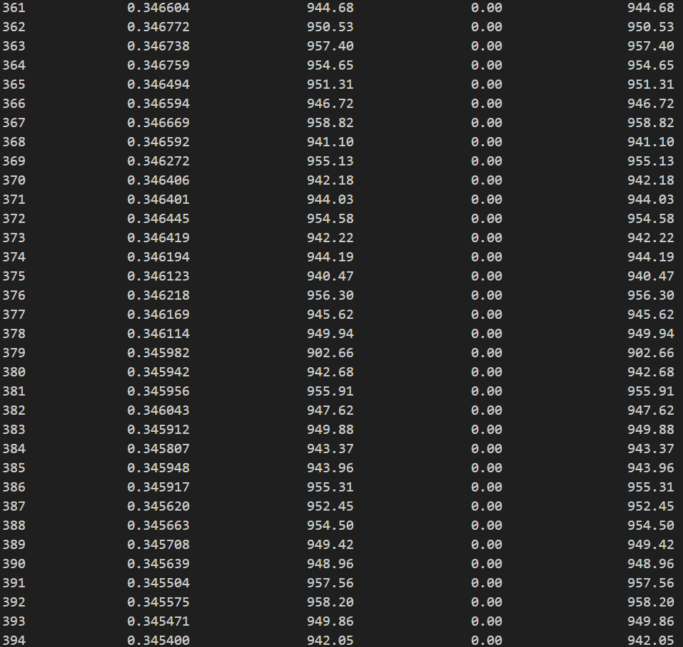

# Mindspore Implementation of the paper [Good helper is around you: Attention-driven Masked Image Modeling](https://arxiv.org/abs/2211.15362)
This is a Mindspore Implementation version for the work. Due to the features of mindspore, the training time for AMT is longer than pytorch version. For more details, please refer to the paper.

Our code is based on [mindcv](https://github.com/mindspore-lab/mindcv). Installation and preparation follow that repo. 

## Pretrain
`python pretrain.py -c amt_b_16_224_pretrain_ascend.yaml` 

## Finetune
`python finetune.py -c amt_b_16_224_finetune_ascend.yaml` 

## Loss log for pretrain

## Accuracy for tiny-imagenet

